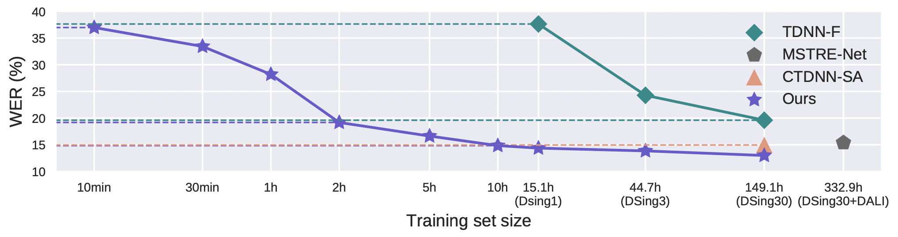

# Automatic Lyric Transcription with DSing
This sub-project contains recipes for training audio-only ALT system for the DSing Dataset. We assume you have downloaded and pre-processed DSing dataset. The DSing dataset is saved at `/path/to/DSing`.

## Prerequisites
Please refer to `DSing/LM/README.md` to train and save language model before running following experiments. The trained RNNLM is saved at `/path/to/RNNLM`.

## How to run

1. Prepare DSing dataset, run:
```
python dsing_prepare.py --data_folder /path/to/DSing --duration_threshold 28
```

2. Train the ALT system for DSing dataset, wav2vec 2.0 has been pretrained and finetuned on ASR data, run:
```
CUDA_VISIBLE_DEVICES=0,1,2,3 python train_wav2vec2.py hparams/train_wav2vec2_finetune.yaml --data_parallel_backend --data_folder /path/to/dsing --pretrained_lm_path /path/to/RNNLM --save_model True --duration_threshold 28
```
The option `--save_model` is used to separately save the model to the folder `DSing/save_model/` besides the CKPT files for the usage of DALI experiments.

3. Train the ALT system for DSing dataset, wav2vec 2.0 has been pretrained on ASR data without finetuned on ASR data, run:
```
CUDA_VISIBLE_DEVICES=0,1,2,3 python train_wav2vec2.py hparams/train_wav2vec2_pretrain.yaml --data_parallel_backend --data_folder /path/to/dsing --pretrained_lm_path /path/to/RNNLM --duration_threshold 28
```

We use four A5000 GPUs (each has 23 GB) to run experiments. To facilitate the training, we eliminate the utterances longer than 28s in the training set. You may want to change the `duration_threshold` based on your GPUs.


## Results
| Release | hyperparams file | Val. WER | Test WER | Model link | GPUs |
|:-------------:|:---------------------------:| -----:| -----:| --------:| :-----------:|
| 22-09-30 | train_wav2vec2_finetune.yaml |  12.34 | 12.99 | https://drive.google.com/drive/folders/1wcvkkZop16ytTuu6JDahUpZ6nsDbD1jN?usp=sharing | 4xA5000 23GB |
| 22-09-30 | train_wav2vec2_pretrain.yaml |  12.64 | 14.58 | https://drive.google.com/drive/folders/1VqKuBkVb_hzeVaD9ecaWuc-VKtNt5wpW?usp=sharing | 4xA5000 23GB |

## Low-Resource ALT
The training and evaluation of low-resource ALT is similar to the above. Please sample less training data to observe the following property:
<p align="center">

</p>