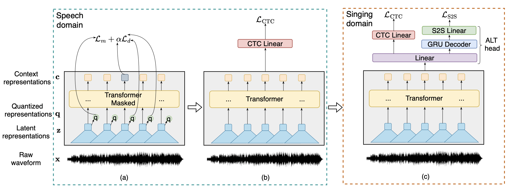

# Transfer Learning of wav2vec 2.0 for Automatic Lyric Transcription
This is the author's official PyTorch implementation for ALT_SpeechBrain. This repo contains code for experiments in the **ISMIR 2022** paper:

[Transfer Learning of wav2vec 2.0 for Automatic Lyric Transcription](https://guxm2021.github.io/pdf/ISMIR2022.pdf)


## Project Description
Automatic speech recognition (ASR) has progressed significantly in recent years due to the emergence of large-scale datasets and the self-supervised learning (SSL) paradigm. However, as its counterpart problem in the singing domain, the development of automatic lyric transcription (ALT) suffers from limited data and degraded intelligibility of sung lyrics. To fill in the performance gap between ALT and ASR, we attempt to exploit the similarities between speech and singing. In this work, we propose a transfer-learning-based ALT solution that takes advantage of these similarities by adapting wav2vec 2.0, an SSL ASR model, to the singing domain. We maximize the effectiveness of transfer learning by exploring the influence of different transfer starting points. We further enhance the performance by extending the original CTC model to a hybrid CTC/attention model. Our method surpasses previous approaches by a large margin on various ALT benchmark datasets. Further experiments show that, with even a tiny proportion of training data, our method still achieves competitive performance.

## Method Overview
<p align="center">

</p>

## Installation
### Environement
Install Anaconda and create the environment with python 3.8.12, pytorch 1.9.0 and cuda 11.1:
```
conda create -n alt python=3.8.12
pip install torch==1.9.1+cu111 torchvision==0.10.1+cu111 torchaudio==0.9.1 -f https://download.pytorch.org/whl/torch_stable.html
```

### SpeechBrain

We run experiments based on [SpeechBrain toolkit](https://github.com/speechbrain/speechbrain). For simiplicity, we remove the original recipes. To install SpeechBrain, run following commands:
```
cd ALT_SpeechBrain
pip install -r requirements.txt
pip install --editable .
```

[Transformers](https://github.com/huggingface/transformers) and other packages are also required:
```
pip install transformers
pip install datasets
pip install sklearn
```
## Datasets
### DSing Dataset
[DSing dataset](https://www.isca-speech.org/archive_v0/Interspeech_2019/pdfs/2378.pdf) is one of the most popular singing datasets. To download and prepare this dataset, we follow its github website https://github.com/groadabike/Kaldi-Dsing-task.

The resulting folder should be organized as:
```
/path/to/DSing
├── dev
├── test
├── train1
├── train3
├── train30
```

### DALI Dataset
[DALI dataset](https://arxiv.org/pdf/1906.10606.pdf) is the largest singing dataset for automatic lyric transcription. We follow the github website https://github.com/gabolsgabs/DALI to download the data and annotations. We use [Demucs v3](https://github.com/facebookresearch/demucs) (mdx_extra model) to perform source separation before training and evaluation on DALI dataset. We organize the data into the following structure. `/path/to/DALI_v2` is the folder for train split and valid split of DALI dataset while `path/to/DALI_Test` is the folder for test split of DALI dataset. 
```
/path/to/DALI_v2
├── data
    ├── utterance1.wav
    ├── utterance2.wav
    ├── ...
├── meta_data.json
/path/to/DALI_Test
├── data
    ├── utterance1.wav
    ├── utterance2.wav
    ├── ...
├── meta_data.json
```
The json file contains the `path`, `duration`, `lyrics`, and `split` for each utterance.

### Hansen / Jamendo / Mauch
[Hansen](https://www.google.com/url?sa=t&rct=j&q=&esrc=s&source=web&cd=&ved=2ahUKEwimq4jirbr6AhUzVXwKHXldDdEQFnoECA4QAQ&url=https%3A%2F%2Fzenodo.org%2Frecord%2F850136%2Ffiles%2Fsmc_2012_054.pdf&usg=AOvVaw2UoRA8cnY4Lpdrmzn8qv2r), [Jamendo](https://arxiv.org/pdf/1902.06797.pdf), [Mauch](https://ieeexplore.ieee.org/document/5876304) are three small datasets, which are used for evaluating the ALT system. We organize the data into the following structure:
```
/path/to/data
├── data
    ├── utterance1.wav
    ├── utterance2.wav
    ├── ...
├── meta_data.json
```
`/path/to/data` is the folder of Hansen or Jamendo or Mauch. The json file contains the `path`, `duration`, `lyrics`, and `split` for each utterance.

NOTE: Please make sure the audio input to model is 16 kHz and has mono-channel.

## Training and Evaluation
We follow the internal logic of SpeechBrain, you can run experiments in this way:
```
cd <dataset>/<task>
python experiment.py params.yaml
```
You may need to create csv files according to our guidance in `<dataset>/<task>`. The results will be saved in the `output_folder` specified in the yaml file. Both detailed logs and experiment outputs are saved there. Furthermore, less verbose logs are output to stdout.

NOTE: The evaluation of Hansen / Jamendo / Mauch datasets are included in the folder `DALI/ALT`.

## Citation
```BibTex
@article{ou2022transfer,
  title={Transfer Learning of wav2vec 2.0 for Automatic Lyric Transcription},
  author={Ou, Longshen and Gu, Xiangming and Wang, Ye},
  journal={arXiv preprint arXiv:2207.09747},
  year={2022}
}
```
We borrow the code from [SpeechBrain](https://arxiv.org/pdf/2106.04624.pdf), please also consider citing their works.


## Also Check Our Relevant Work
**MM-ALT: A Multimodal Automatic Lyric Transcription System**<br>
Xiangming Gu*, Longshen Ou*, Danielle Ong, Ye Wang<br>
*ACM International Conference on Multimedia (ACM MM), 2022, (Oral)*<br>
[[paper](https://guxm2021.github.io/pdf/ACMMM2022.pdf)][[code](https://github.com/guxm2021/MM_ALT)]


## License
ALT_SpeechBrain is released under the Apache License, version 2.0.
